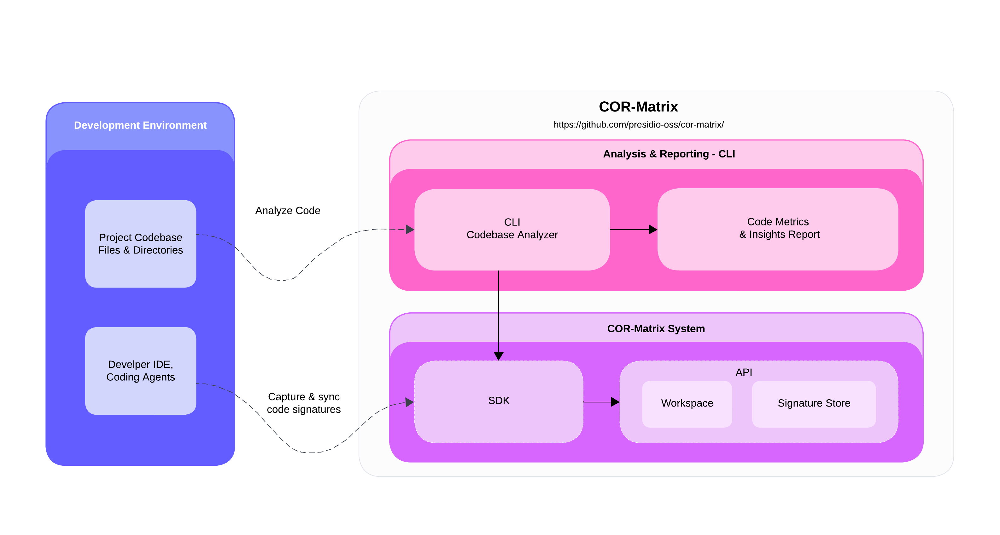

# COR-Matrix

**Code Origin Ratio Matrix** - Track and analyze how much AI-generated code survives in your codebase over time.

<div align="center">
  <picture>
    <source media="(prefers-color-scheme: dark)" srcset="assets/img/cor-matrix.png">
    <source media="(prefers-color-scheme: light)" srcset="assets/img/cor-matrix.png">
    
  </picture>
</div>

## What is COR-Matrix?

COR-Matrix helps development teams understand the real-world impact of AI-generated code by tracking what percentage of originally AI-generated code remains unchanged versus modified or removed during development.

**The Problem:** Teams using AI coding assistants don't know if the generated code is actually useful long-term or gets rewritten immediately.

**The Solution:** COR-Matrix captures signatures of AI-generated code as it's written, then analyzes your codebase later to show retention rates and code evolution patterns.

## Quick Start

### 1. Start the API Server

#### Option A: Using Docker Compose (Recommended)

```bash
# Set up environment variables
cp .env.example .env
# Edit .env file with your actual values

# Start the API server with Docker
docker-compose up -d
```

#### Option B: Local Development

```bash
# Install dependencies
bun install

# Set up environment variables
cp .env.example .env
# Edit .env file with your actual values

# Run database migrations
bun run db:push

# Start the API server
bun run dev:api
```

The API will be available at `http://localhost:3000` with documentation at `http://localhost:3000/docs`.

### 2. Track AI-Generated Code (SDK)

Install the client SDK in your project:

```bash
npm install @presidio-dev/cor-matrix
```

Integrate tracking into your development workflow:

```javascript
import { CorMatrix } from "@presidio-dev/cor-matrix";

const corMatrix = new CorMatrix({
  appName: "my-app",
  baseURL: "http://localhost:3000",
  token: "your-workspace-token",
  workspaceId: "your-workspace-id",
});

// Track AI-generated code as you write it
corMatrix.addCodeOriginRecord({
  code: "console.log('Hello from AI');",
  path: "src/index.ts",
  language: "typescript",
  generatedBy: "copilot",
});
```

### 3. Generate Reports (CLI)

Analyze your codebase to see AI code retention:

```bash
npx @presidio-dev/cor-matrix report \
  --workspace-id your-workspace-id \
  --project-path /path/to/your/project \
  --api-url http://localhost:3000 \
  --api-token your-workspace-token
```

Example output:

```
 COR-Matrix REPORT
────────────────────────────────────────────────
AI Generated Lines:             263 (100.00%)
AI Generated Retained Lines:     40 (15.21%)
AI Generated Removed/Changed:   223 (84.79%)
────────────────────────────────────────────────
```

## Development

```bash
# Database operations
bun run db:generate    # Generate migrations
bun run db:push        # Apply migrations
bun run db:studio      # Open database GUI

# Development
bun run dev:api        # Start API server with hot reload
bun run build:client   # Build client SDK
bun run build:api      # Build API Docker image
```

## Architecture

- **API Server**: Elysia.js REST API with SQLite database
- **SDK**: Node.js library for real-time code tracking
- **CLI**: Command-line tool for codebase analysis
- **Database**: Stores code signatures and workspace data

Built with TypeScript, Bun, Drizzle ORM, and Docker.

## Contributing

We welcome contributions! Please see [CONTRIBUTING.md](CONTRIBUTING.md) for guidelines.

## License

This project is licensed under the MIT License - see the [LICENSE](LICENSE) file for details.

## Security

For security concerns, please see our [Security Policy](SECURITY.md).
